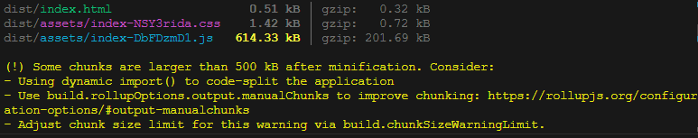
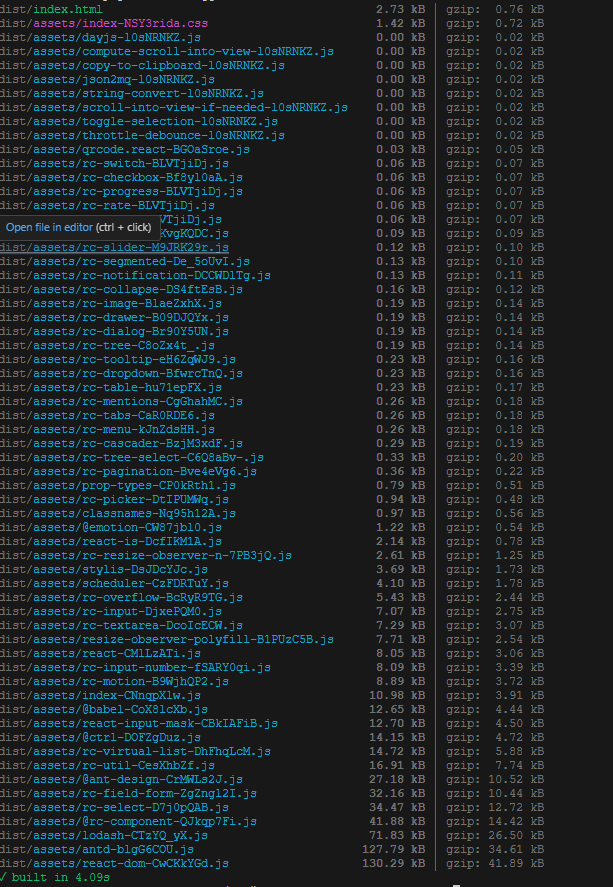

# Тестовое задание для разработчика

## Описание:

Вам предоставляется следующий код компонента React, который является частью большого проекта. Задача состоит в том, чтобы проанализировать данный код и выполнить его рефакторинг с целью улучшения его читаемости, производительности и поддерживаемости.

## Задачи:

-   Первая задача:

1. Упрощение логики.

    - onChange (in TextInputWithActions): удаление дублирующегося кода;
    - checkReadOnly (in TextInputWithActions): создание единого метода проверки опции readOnly
    - onChangeNumber (in TextInputWithActions): упразднение метода;

2. Оптимизация производительности.

    - уменьшение размеров некоторых пакетов  
    - улучшение парметра SEO  

3. Улучшение структуры.

    - "разбивка" UniversalInput и вынесение части кода в отдельные файлы:
      TextInputWithActions и CodeEditor (логика и последовательность подключения не нарушена).
    - выделение определения входящего поля Input в отельный метод createControl;
    - изменение createControl с метода "if-else" на метод "switch",
    - изменение набора деструктурированных переменных в соответствии с разделенной функцией (для избежания проброса неиспользуемых переменных);

4. Обработка ошибок и граничных случаев.
    - renderSelectOption (in TextInputWithActions): добавления индекса в опцию для корректной работы метода map;
    - установка пакета PropsType для безопасной работы с типами данных;
    - изменено поведение стилей на минимальных разрешениях экрана.
    - заменены устаревшие методы библиотеки antd.

**Важно: в готовом задании не разрешается просто вытаскивать отдельно каждый компонент из UniversalInput в родительский компонент.**

-   Классы были вынесены в отдельные файлы для удобства работы с кодом, но остались в компоненте UniversalInput.

> Компонент нельзя удалять, потому что предполагается, что он должен быть абстрактным для применения и построения форм. API для взаимодействия с компонентом UniversalInput должно быть гибким.

-   класс не был удален, логика не нарушена, неиспользуемые переменные сохранены

-   Вторая задача:

1. Нужно, чтобы данные инпутов хранились в localStorage.

    - данные (за исключением первого Input) автоматически сохраняются в localStorage c присвоением ключа (id) соответвствующего поля ввода

2. Необходима синхронизация между вкладками через localStorage.
    - синхронизация (за исключением первого Input) налажена. Данные полей восстанавливаются на другой вкладке после обновления страницы. Возможна реализация синхронизации страниц в режиме реального метода, однако это повлияет на производительность.

## **Ожидаемый результат:**

-   Отрефакторенный код, соответствующий указанным задачам.
-   Решение с готовым кодом в репозитории на git hub/архивом.

    [ссылка на Github](https://github.com/homo-errantium/devTestTask)

## **Фактический результат:**

Что получилось:

-   сложные и громоздкие функции были вынесены в отдельные методы;
-   код разбит на несколько частей для удобства работы;
-   подключена дополнительная проверка типов;
-   настроена работа с localStorage;

Что не получилось:

-   не настроена работа первого поля ввода (input type='number');
-   не удалось доконца оптимизировать производительность загрузки страницы

Что воможно улучшить:

-   для улучшения производительности желательно подключить хуки useMemo и useCallback. Однако данные хуки работают только на функциональных компонентах.
-   поискать альтернативу библиотеке antd:
    1. некотрые методы данной библиотеки устарели, их поддержка браузерами, возможно будет прекращена.
    2. неудобство в сжатии файлов библиотеки для оптимизации
-   проанализировать массив атрибутов, передаваемый в UniversalInput и в его дочерние элементы. Некотрые свойства и методы не задейстованы ни в одной функции, возможно сокращение кода.
